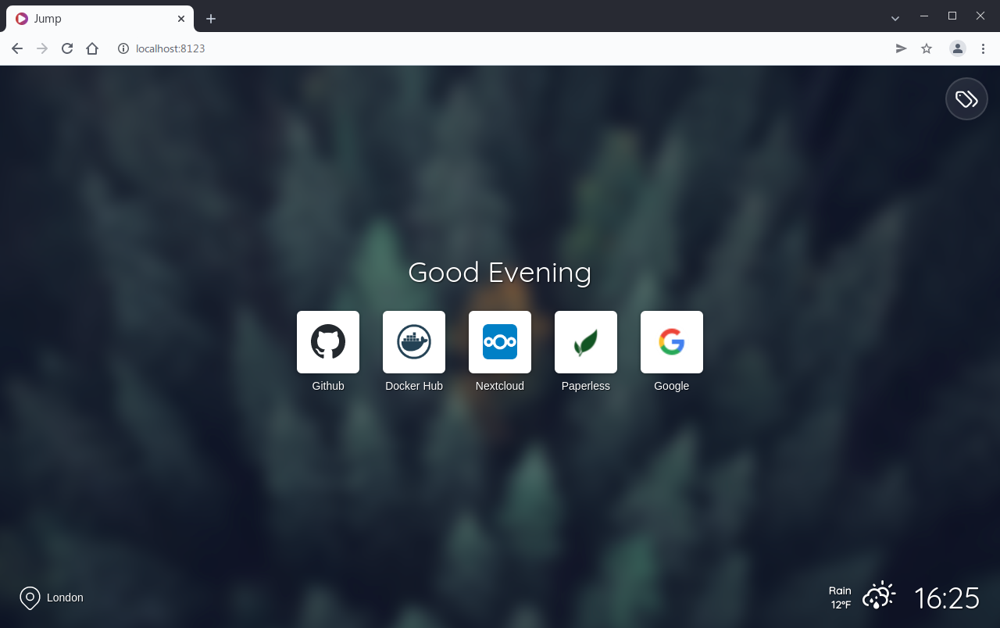
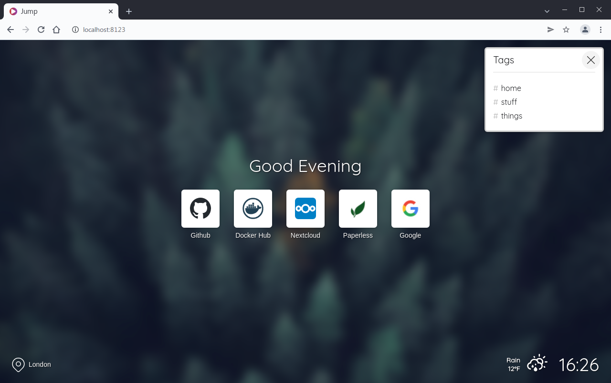
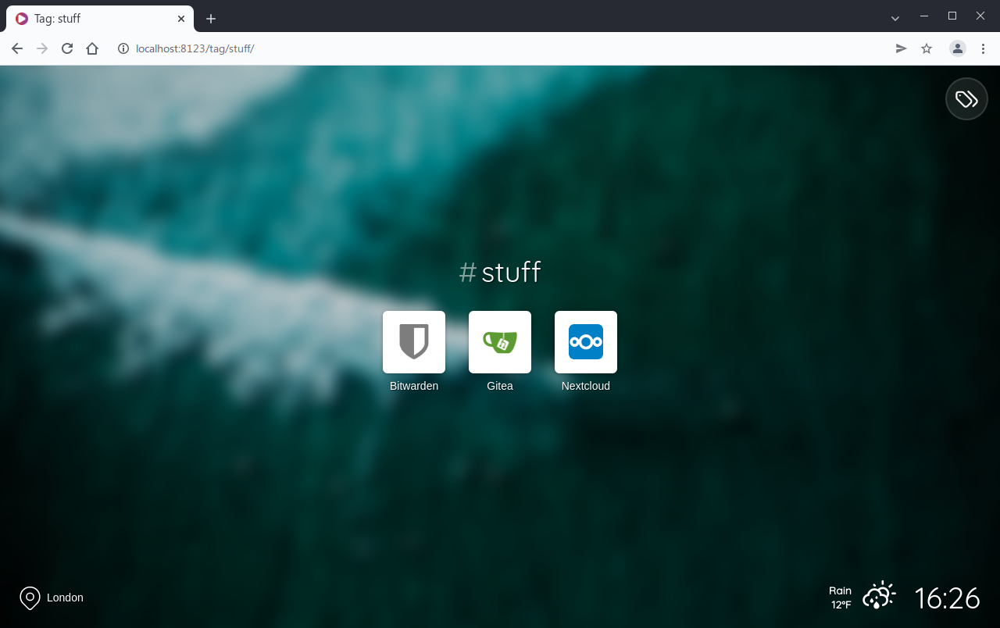

# Jump


Jump is yet another self-hosted startpage for your server designed to be simple, stylish, fast and secure.



 

### Features

- Fast, easy to deploy, secure
- Custom sites and icons
- Categorise sites with tags
- Fetch favicons for sites without custom icons
- Custom background images
- Open Weather Map integration


## Installation

### Docker

Get the container image from Docker Hub (https://hub.docker.com/r/daledavies/jump).

The following will start Jump and serve the page at http://localhost:8123 with a custom site name, Open Weather Map support, and volumes to map Jump's "backgrounds" and "sites" directories to local directories on your machine...

```yaml
version: '3'
services:
    web:
        image: daledavies/jump
        ports:
            - 8123:8080
        volumes:
            - ./backgrounds:/backgrounds
            - ./sites:/sites
        environment:
            SITENAME: 'Custom site name'
            OWMAPIKEY: '0a1b2c3d4e5f6a7b8c9d0a1b'
            LATLONG: '51.509865,-0.118092'

```

You can use the following optional environment variables to configure/customise your Jump site...

- `SITENAME` - Custom site name.
- `SHOWCLOCK: 'true'` - Show/hide the clock.
- `AMPMCLOCK: 'true'` - Show 12 hour clock format if true.
- `SHOWGREETING: 'true'` - Show a friendly greeting message rather than "#home".
- `BGBLUR: 70` - Background image blur percentage.
- `BGBRIGHT: 85` - Background image brightness percentage.
- `NOINDEX: 'true'` - Include a robots noindex meta tag in site header
- `CACHEBYPASS: 'true'` - Bypass all caches, useful for testing changes.
- `OWMAPIKEY` - An API key for Open Weather Map, LATLONG (below) must also be defined.
- `LATLONG` - A latitude and longitude for the default location (e.g. "51.509865,-0.118092").
- `METRICTEMP: 'true'` - Metric (C) or imperial (F) temperature units.

#### Volume Mapping

You can map the "backgrounds" and "sites" directories to local directories as shown in the Docker Compose example above. Your local directories will be populated with Jump's default files when the container is next started unless the local directories already contain files, in which case the local files will be used by Jump instead.

### Podman
The following will start Jump and serve the page at http://localhost:8123 with a custom site name, Open Weather Map support, and volumes to map Jump's "backgrounds" and "sites" directories to local directories on your machine...

```
podman run -d --volume <path/to/backgrounds>:/backgrounds:Z \
--volume <path/to/sites>:/sites:Z -p 8123:8080 \
--env SITENAME='Welcome' --env OWMAPIKEY='<open weather api key>' \
--env LATLONG='<lat, lon>' --name jump docker.io/daledavies/jump 
```
This will start the service but you will have to run above command again in case of power cycle. To make this config more permanent do this
1. Go to Systemd user director usually located in `~/.config/systemd/user/`
2. Generate Systemd unit file using `podman generate systemd --new --name jump > jump.service`
3. Use `--user` attribute to run the service as a user service `systemd --user start containe-jump.service`


### Without Docker

Clone this repository and copy everything within the `jumpapp` directory to your server, edit `config.php` accordingly.

Install dependencies via composer by running the following command within the web root...

```bash
composer install --no-dev
```

Make sure you have created a cache directory and given the web user permission to write to it, the cache directory should match your `config.php` entry for `cachedir`.

## Configuration

### Open Weather Map

You can configure Jump to get local time and weather updates by adding an Open Weather Map API key to `config.php` or passing the `OWMAPIKEY ` environment variable to the docker container (as described above).

You will also need to provide a default `LATLONG` string (e.g. "51.509865,-0.118092"), Jump will use this  until you press the location button and allow permission to get your location from the web browser.

### Sites

Edit the `/sites/sites.json` file to include your own sites on the startpage...

```json
{
    "default": {
        "nofollow": true,
        "icon": "my-default-icon.png",
        "newtab": false
    },
    "sites": [
        {
            "name": "Github",
            "url" : "https://github.com/daledavies/jump",
            "nofollow": false,
            "newtab": true
        },
        {
            "name": "Bitwarden",
            "url" : "https://bitwarden.example.com",
            "icon": "bitwarden.png",
            "tags": ["stuff"]
        },
        {
            "name": "Gitea",
            "url" : "https://git.example.com",
            "icon": "gitea.png",
            "tags": ["stuff"]
        },
        {
            "name": "Nextcloud",
            "url" : "https://cloud.example.com",
            "icon": "nextcloud.png",
            "tags": ["home", "stuff", "things"]
        },
        {
            "name": "Paperless",
            "url" : "https://paperless.example.com",
            "icon": "paperless.jpg",
            "tags": ["things", "home"]
        },
        {
            "name": "Google",
            "url" : "https://www.google.com"
        }
    ]
}

```

* `name` and `url` are mandatory.
* `tags`, `nofollow`, `newtab` and `icon` are optional.

#### Tags

Sites can be categorised using tags, for each site in your `sites.json` file you can list multiple tags as shown in the example above. Sites that have no tags are included on the home screen, however for sites with multiple tags you can specify the "home" tag to include them on the home screen.

The tag selector button will only appear in the top right of the page if you have tagged sites, clicking this will open a popup menu showing all the tags referenced in your `sites.json` file.

#### Default Options

Jump has a built-in default icon for sites that do not specify their own although you can override this and specify your own as shown above in the `default` section.

You can also override `nofollow` and `newtab` to be `true` for all sites.

#### Icons

You can provide custom icons for your sites by placing them in the `/sites/icons/` directory and referencing the filename in `sites.json` using the `icon` option. If you do not provide a custom icon for a site then Jump will attempt to retrieve that site's favicon, if it can't find one then the default icon will be shown.

#### nofollow

On a per-site basis use `"nofollow": true` to include `rel="nofollow"` on specific site links, if this is set as a global default then `"nofollow": false` can be used to remove `rel="nofollow"` for individual sites.

#### newtab

On a per-site basis use `"newtab": true` to open specific site links in a new browser tab.

### Background Images

To use your own background images just copy them to the `/backgrounds/` directory, Jump will pick up on them automatically.

## Development

Patches, improvements and feature requests are welcomed although I want to avoid anything that requires a database, admin interface or user accounts.

For development you will need to install composer dependencies by running `composer install` from within the `jumpapp` directory.

Javascript is bundled using Webpack, so you will need to have installed Node.js. Then within the root project directory (the same level as webpack.config.js) you should run `npm install`.

Before starting development you can run `npm run dev`, this will watch for changes to files within the `/assets/js/src/`directory and bundle them on the fly. The javascript bundle (`index.bundle.js`) created in development mode will not be minified and will contain source maps for debugging.

You can test a production build using `npm run build`, this will bundle and minify the javascript source files without source maps.

Please do not commit javascript bundles, only commit the patched source files.
