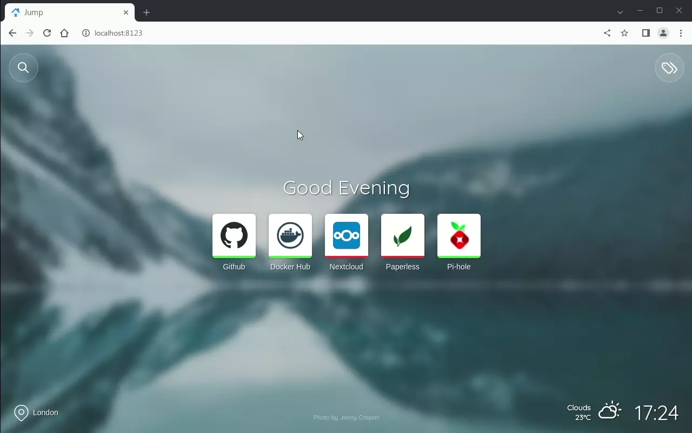

# Jump


Jump is yet another self-hosted startpage for your server designed to be simple, stylish, fast and secure.



### Features

- Fast, easy to deploy, secure.
- Easily add sites and use custom icons, or let Jump fetch their original favicons.
- Categorise sites with tags across multiple pages.
- Real-time status monitoring for each site.
- Use your own background images or get random background images from Unsplash.
- Fast search by name, tag, url with keyboard shortcut.
- Custom list of search engines accessed via search box.
- Open Weather Map integration for local time and weather.
- Several layout options, including responsive UI for mobile devices.
- Easily enable/disable all configuration options, tailor Jump to suit your needs.

### Demo - [jumpdemo.daledavies.co.uk](https://jumpdemo.daledavies.co.uk)

Note - the demo instance is hosted on a render.com free tier so may take a few seconds to wake up.


## Installation

### Docker Compose

Get the container image from Docker Hub (https://hub.docker.com/r/daledavies/jump).

The following will start Jump and serve the page at http://localhost:8123 with a custom site name, Open Weather Map support, and volumes to map Jump's "backgrounds", "favicon", "search" and "sites" directories to local directories on your machine (`OWMAPIKEY` and `LATLONG` values below are just for example)...

```yaml
version: '3'
services:
    web:
        image: daledavies/jump
        ports:
            - 8123:8080
        volumes:
            - ./backgrounds:/backgrounds
            - ./favicon:/favicon
            - ./search:/search
            - ./sites:/sites
        environment:
            SITENAME: 'Custom site name'
            OWMAPIKEY: '0a1b2c3d4e5f6a7b8c9d0a1b'
            LATLONG: '51.509865,-0.118092'

```

You can use the following optional environment variables to configure/customise your Jump site...

- `SITENAME` - Custom site name.
- `SHOWCLOCK: 'false'` - Hide the clock.
- `AMPMCLOCK: 'true'` - Show 12 hour clock format if true.
- `SHOWGREETING: 'false'` - Show the label "#home" instead of a friendly greeting message.
- `SHOWSEARCH : 'false'` - Hide the search button (disable search).
- `ALTLAYOUT: 'true'` - Display list of sites using an [alternative layout](/screenshots/screenshot-altlayout.png).
- `BGBLUR: 50` - Background image blur percentage.
- `BGBRIGHT: 90` - Background image brightness percentage.
- `UNSPLASHAPIKEY` - An API key for Unsplash, enables fetching random background images from Unsplash.
- `UNSPLASHCOLLECTIONS` - List of Unsplash collection ID's (separated by commas) to select random images from.
- `ALTBGPROVIDER` - An alternative background provider url.
- `OWMAPIKEY` - An API key for Open Weather Map, LATLONG (below) must also be defined.
- `LATLONG` - A latitude and longitude for the default location (e.g. "51.509865,-0.118092").
- `METRICTEMP: 'true'` - Metric (C) or imperial (F) temperature units.
- `CHECKSTATUS: 'false'` - Disable checking site availability status.
- `STATUSCACHE: 5` - Duration in minutes to cache site availability status.
- `NOINDEX: 'true'` - Include a robots noindex meta tag in site header.
- `CACHEBYPASS: 'true'` - Bypass all caches, useful for testing changes.
- `WWWURL` - Useful if Jump is hosted in a sub-directory (e.g. "/startpage").
- `DISABLEIPV6` - Disable IPV6 if required.

**NOTE:** The `OWMAPIKEY` and `LATLONG` config options must be defined together.

#### Volume Mapping

You can map the "backgrounds",  "favicon", "search" and "sites" directories to local directories as shown in the Docker Compose example above. Your local directories will be populated with Jump's default files when the container is next started unless the local directories already contain files, in which case the local files will be used by Jump instead.

#### Docker

The same can be achieved just using Docker CLI...

```bash
docker run -d -p 8123:8080 \
--volume <path/to/backgrounds>:/backgrounds \
--volume <path/to/favicon>:/favicon \
--volume <path/to/sites>:/sites \
--volume <path/to/search>:/search \
--env SITENAME='Custom site name' \
--env OWMAPIKEY='<open weather api key>' \
--env LATLONG='<lat,long>' \
--name jump docker.io/daledavies/jump
```

### Without Docker

Clone this repository and copy everything within the `jumpapp` directory to your server, edit `config.php` accordingly.

Install dependencies via composer by running the following command within the web root...

```bash
composer install --no-dev
```

Make sure you have created a cache directory and given the web user permission to write to it, the cache directory should match your `config.php` entry for `cachedir`.

## Configuration

### Open Weather Map

You can configure Jump to get local time and weather updates by adding an Open Weather Map API key to `config.php` or passing the `OWMAPIKEY ` environment variable to the Docker container (as described above).

You will also need to provide a default `LATLONG` string (e.g. "51.509865,-0.118092"), Jump will use this  until you press the location button and allow permission to get your location from the web browser.

### Sites

Edit the `/sites/sites.json` file to include your own sites on the startpage...

```json
{
    "default": {
        "nofollow": true,
        "icon": "my-default-icon.png",
        "newtab": false
    },
    "sites": [
        {
            "name": "Github",
            "url" : "https://github.com/daledavies/jump",
            "description": "This is an example description",
            "nofollow": false,
            "newtab": true
        },
        {
            "name": "Docker Hub",
            "url" : "https://hub.docker.com/r/daledavies/jump"
        },
        {
            "name": "Bitwarden",
            "url" : "https://bitwarden.example.com",
            "description": "This is another example of a site with a description",
            "icon": "bitwarden.png",
            "tags": ["stuff"]
        },
        {
            "name": "Gitea",
            "url" : "https://git.example.com",
            "icon": "gitea.png",
            "tags": ["stuff"]
        },
        {
            "name": "Nextcloud",
            "url" : "https://cloud.example.com",
            "icon": "nextcloud.png",
            "tags": ["home", "stuff", "things"]
        },
        {
            "name": "Paperless",
            "url" : "https://paperless.example.com",
            "icon": "paperless.jpg",
            "tags": ["things", "home"]
        },
        {
            "name": "Google",
            "url" : "https://www.google.com",
            "nofollow": false
        }
    ]
}

```

* `name` and `url` are mandatory.
* `description`, `tags`, `nofollow`, `newtab` and `icon` are optional.

#### Tags

Sites can be categorised using tags, for each site in your `sites.json` file you can list multiple tags as shown in the example above. Sites that have no tags are included on the home screen, however for sites with multiple tags you can specify the "home" tag to include them on the home screen.

The tag selector button will only appear in the top right of the page if you have tagged sites, clicking this will open a popup menu showing all the tags referenced in your `sites.json` file.

#### Default Options

Jump has a built-in default icon for sites that do not specify their own although you can override this and specify your own as shown above in the `default` section.

You can also override `nofollow` and `newtab` to be `true` for all sites.

#### Icons

You can provide custom icons for your sites by placing them in the `/sites/icons/` directory and referencing the filename in `sites.json` using the `icon` option. If you do not provide a custom icon for a site then Jump will attempt to retrieve that site's favicon, if it can't find one then the default icon will be shown.

#### nofollow

On a per-site basis use `"nofollow": true` to include `rel="nofollow"` on specific site links, if this is set as a global default then `"nofollow": false` can be used to remove `rel="nofollow"` for individual sites.

#### newtab

On a per-site basis use `"newtab": true` to open specific site links in a new browser tab.

### Search

Edit the `/search/searchengines.json` file to customise the list of search engines available from the search dropdown, the first search engine in the list will be the default...

```json
[
    {
        "name": "Google",
        "url": "https://www.google.co.uk/search?q="
    },
    {
        "name": "DuckDuckGo",
        "url": "https://duckduckgo.com/?q="
    },
    {
        "name": "Bing",
        "url": "https://www.bing.com/search?q="
    }
]
```

For quick access to the search from the keyboard you can open the search bar using the `ctrl-shift-/` keyboard shortcut and start typing straight away.

### Background Images

To use your own background images just copy them to the `/backgrounds/` directory, Jump will pick up on them automatically ans show a random image every time the page loads.

If instead you want to use Unsplash for random background images add an Unsplash API key to `config.php` or pass the `UNSPLASHAPIKEY ` environment variable to the Docker container. You can provide a comma separated list of collection ID's using the `unsplashcollections` option in `config.php` or by passing them to the Docker container via the `UNSPLASHCOLLECTIONS` environment variable.

### Favicon

After mapping the `favicon` directory as shown in the Docker Compose or Docker examples above, replace the default `icon.png` file with whatever PNG icon image you want (ensuring that the filename is always `icon.png`).

## Development

Patches, improvements and feature requests are welcomed although I want to avoid anything that requires an admin interface or user accounts.

For development you will need to install composer dependencies by running `composer install` from within the `jumpapp` directory.

Javascript is bundled using Webpack, so you will need to have installed Node.js. Then within the root project directory (the same level as webpack.config.js) you should run `npm install`.

Before starting development you can run `npm run dev`, this will watch for changes to files within the `/jumpapp/assets/js/src/`, `/jumpapp/assets/css/src/` and `/jumpapp/templates/src/` directories and bundle them on the fly. Javascript and CSS bundles created in development mode will not be minified and will contain source maps for debugging.

You can test a production build using `npm run build` which will bundle and minify the javascript and CSS source files without source maps, header and footer templates will be created containing the correct links to newly created javascript and CSS bundles.

Please do not commit any generated files however, only commit the patched source files.
